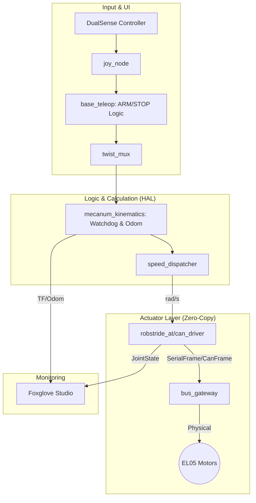

# ROX2026 Tatzv Experimental

The ultimate high-performance mecanum robot controller. Optimized for reliability, speed, and developer experience.

## 🚀 Key Features
- **All-C++ Zero-Copy Architecture**: High-speed communication using ROS 2 Composable Components.
- **Safety First**: Hardware-level Watchdog, DualSense Emergency Stop, and Lifecycle management.
- **Modern Stack**: Nix Flakes for tools, Docker for runtime, and Foxglove for visualization.
- **Self-Healing CI**: Automated style fixing and cross-distribution (Humble/Jazzy) validation.

## 🏗️ System Architecture


## 🛠️ Quick Start
1. **Prepare Host**: Install Nix and `direnv`.
2. **Setup**: `direnv allow` (This installs all tools and sets up X11 automatically).
3. **Build**: `make build` then `make colcon`.
4. **Launch**: `make launch` (or `make virtual` for mock testing).

## 🎮 Controls (DualSense)
- **Select (Create)**: ARM system (Activate movement).
- **Touchpad Click**: STOP system (Universal lock).
- **L Stick / R Stick**: Strafe and Yaw movement.
- **R1 / L1**: High-precision deadband control.
```
