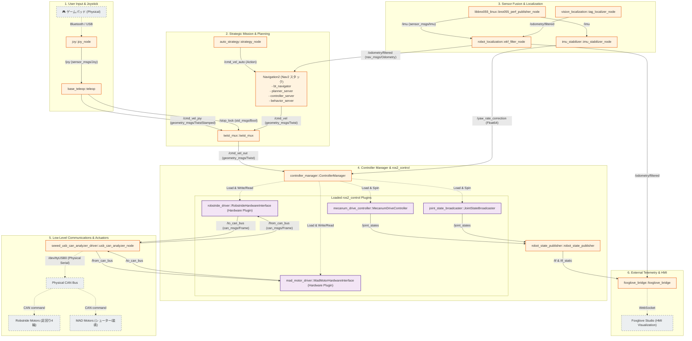

# ROX2026 ROS 2 パッケージ構成 & システムアーキテクチャ

本ドキュメントでは、`rox2026-tatzv-experimental` ワークスペース（`main_ws`）における現在の全10パッケージの役割、フォルダ構成、およびそれらがどのように相互作用して自動運転やロボット制御を実現しているかのアーキテクチャについて解説します。

---

## 1. パッケージ一覧と役割

ワークスペースは ROS 2 (Jazzy) 環境下で `ros2_control` を中心としたモダンなアーキテクチャに統合されており、不要なレガシーコードを排除した全10パッケージで構成されています。

| パッケージ名 | カテゴリ | 役割・説明 |
| :--- | :--- | :--- |
| **[robot_bringup](file:///Users/tatsukiyano/rox2026-tatzv-experimental/main_ws/src/bringup/robot_bringup)** | Bringup / 統合起動 | システム全体の起動設定。URDF/Xacro（3Dモデル定義）、カルマンフィルタ（EKF）による自己位置推定、コントローラ（`controllers.yaml`）などのパラメータや起動ファイルを一元管理します。 |
| **[base_teleop](file:///Users/tatsukiyano/rox2026-tatzv-experimental/main_ws/src/teleop/base_teleop)** | Teleop / 操縦 | ゲームパッド（PS4コントローラ等）の入力を受け取り、ロボットの並進・旋回速度（`geometry_msgs/msg/Twist`）へと変換してパブリッシュします。 |
| **[base_navigation](file:///Users/tatsukiyano/rox2026-tatzv-experimental/main_ws/src/navigation/base_navigation)** | Navigation / 自律走行 | Navigation2 (Nav2) スタックのパラメータと起動ファイル。コストマップ生成、静的・動的障害物の回避、および目的地までの最適な経路計画を行います。 |
| **[auto_strategy](file:///Users/tatsukiyano/rox2026-tatzv-experimental/main_ws/src/auto_strategy)** | Strategy / 自律ミッション | 自律移動（Nav2連携） ➡ 目的地でのターゲット（AprilTag）探索 ➡ フィードバックアライメント旋回 ➡ シューター起動までを自動で行うミッションコントロール・ステートマシンです。 |
| **[imu_stabilizer](file:///Users/tatsukiyano/rox2026-tatzv-experimental/main_ws/src/control/imu_stabilizer)** | Control / 姿勢安定 | IMU（ジャイロセンサー）のデータをローパスフィルタで平滑化し、目標進行方向（Yaw角）に対してPID制御を用いた補正出力をかけて、スリップや機体の傾きによる進行ブレを打ち消します。 |
| **[control_analysis](file:///Users/tatsukiyano/rox2026-tatzv-experimental/main_ws/src/control_analysis)** | Control / 制御解析 | ロボットの応答特性を自動で計測・解析する制御工学解析ツール。モーターに対してステップ入力、正弦波、チャープ信号を印加し、周波数応答や伝達関数、ボーデ線図を自動生成します。 |
| **[libbno055_linux](file:///Users/tatsukiyano/rox2026-tatzv-experimental/main_ws/src/drivers/sensors/libbno055-linux)** *(Submodule)* | Driver / センサー | BNO055 IMUセンサー用のパフォーマンスチューニング済み高信頼ドライバー。I2C of auto recovery、通信ドロップを防止する例外フリー設計、およびパブリッシュの高速化（ゼロコピー化）を実現します。 |
| **[robstride_driver](file:///Users/tatsukiyano/rox2026-tatzv-experimental/main_ws/src/drivers/actuators/robstride_driver)** | Driver / モーター | Robstrideダイレクトドライブモーター用の `ros2_control` ハードウェアインターフェース。車輪回転数やトルクフィードバックをROS 2コントロールへ同期させます。 |
| **[mad_motor_driver](file:///Users/tatsukiyano/rox2026-tatzv-experimental/main_ws/src/drivers/actuators/mad_motor_driver)** | Driver / モーター | MADブラシレスモーター用の `ros2_control` ハードウェアインターフェースおよびコンポーネントノード。高出力な駆動モジュールを制御します。 |
| **[seeed_usb_can_analyzer_driver](file:///Users/tatsukiyano/rox2026-tatzv-experimental/main_ws/src/drivers/communication/usb_can_analyzer)** | Driver / 通信ブリッジ | Seeed USB-CAN Analyzerモジュールと通信し、PC/RDK上のシリアルと実機のCANバス間でCANメッセージフレームを高速にルーティングする低レベルブリッジ。 |

---

## 2. システムデータフロー（アーキテクチャ）

ロボットシステム内のトピック、コントローラ、およびデバイスドライバー間のデータフローは以下の通りです。



---

## 3. ディレクトリ構成

ワークスペース全体の物理構成は以下の通りスリム化されています。

```text
rox2026-tatzv-experimental/
├── Justfile                      # ホスト側Docker/開発環境の管理用コマンド
├── docker/                       # ROS 2 Jazzy 開発環境 Docker イメージ & Compose 定義
├── docs/                         # 設計資料・ドキュメント（本フォルダ）
│   ├── packages.md               # パッケージ構成（本ドキュメント）
│   ├── can_specification.md      # モーターCAN通信仕様
│   └── shooter_architecture.md   # シューター構造仕様
└── main_ws/                      # ROS 2 Jazzy ワークスペース
    ├── Justfile                  # コンテナ内 colcon ビルド / テスト実行用コマンド
    └── src/                      # ソースパッケージコード
        ├── auto_strategy/        # 自律戦略ステートマシン
        ├── bringup/              # robot_bringup パッケージ（launch & config）
        ├── control/              # imu_stabilizer パッケージ
        ├── control_analysis/     # 制御応答解析ツール
        ├── navigation/           # base_navigation パッケージ
        ├── teleop/               # base_teleop パッケージ
        └── drivers/              # 各種ハードウェアドライバ
            ├── actuators/        # モーター（robstride, mad_motor_driver）
            ├── communication/    # seeed_usb_can_analyzer_driver
            └── sensors/          # libbno055_linux (サブモジュール化)
```

---

## 4. 各種起動手順

`Justfile` を用いて、Dockerコンテナ内またはホスト側からコマンド一発で各種起動が可能です。

### A. シミュレータの起動 (GUI画面表示付き)
noVNCを利用した仮想ディスプレイが立ち上がり、ブラウザ経由で Gazebo シミュレーションを確認できます。
```bash
just sim-gui
```

### B. 実機ロボットの起動 (ros2_controlベース)
実機での動作、またはモックハードウェアを用いた実機ノードのテスト実行が可能です。
```bash
# 実機ノードの起動
just launch

# モックハードウェアを使用したシミュレート起動（センサー通信等がモックされます）
just launch use_mock_hardware:=true
```

### C. 制御解析プログラムの実行
機体に対して自動でステップ応答等をかけ、`reports/` フォルダ下に制御工学レポート（Bode Plot、ステップ応答グラフ）を自動生成します。
```bash
just analyze-control
```
